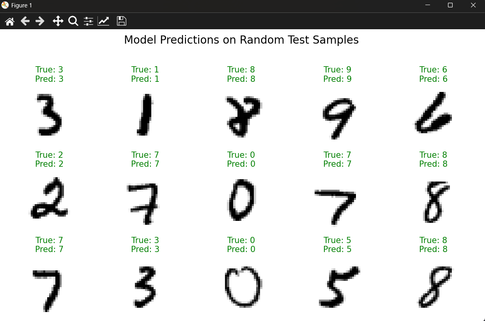

# Handwritten Digit Recognizer (MNIST)

This project features a Convolutional Neural Network (CNN) built from scratch using TensorFlow and Keras to classify handwritten digits from the famous MNIST dataset.

## Technologies
* Python
* TensorFlow
* Keras
* Matplotlib

## Features
* **Custom CNN Architecture:** A well-structured CNN with convolutional, pooling, and dense layers designed for high accuracy.
* **High Performance:** Achieves over 98% accuracy on the unseen test set.
* **Visual Confirmation:** The program concludes by plotting random test images alongside the model's predictions, providing clear visual proof of its effectiveness.

## Sample Output

